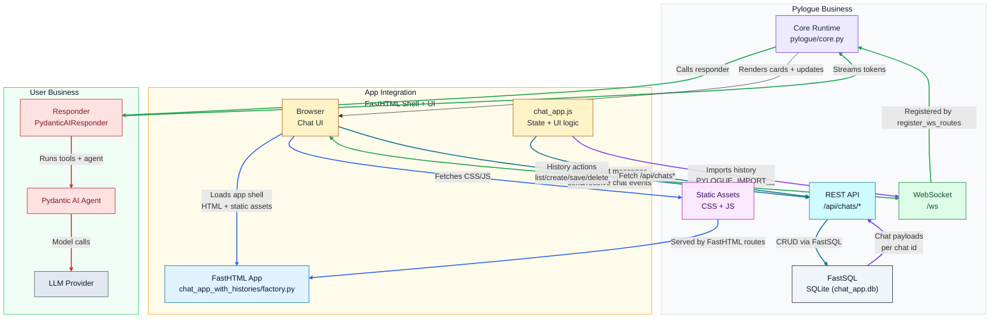
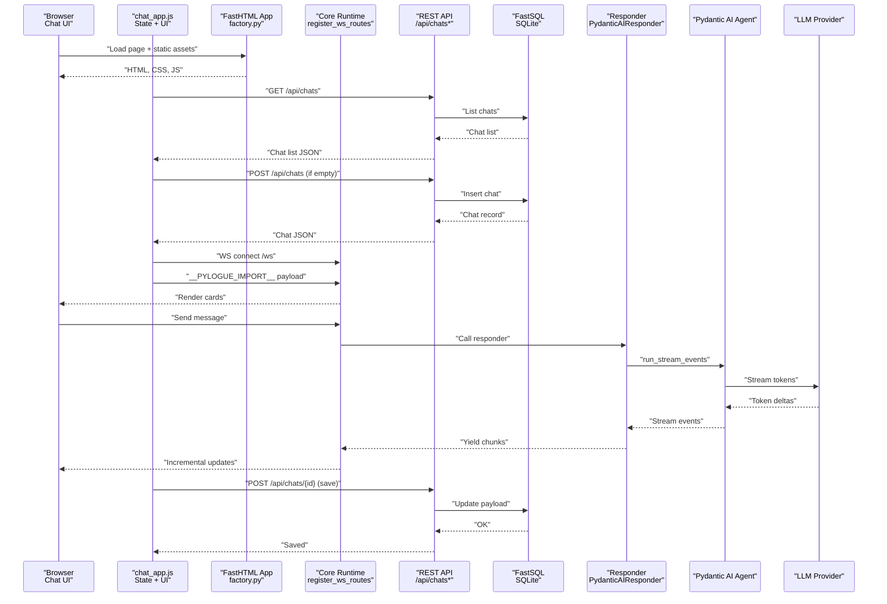

```mermaid
---
width: 90vw
---
flowchart TD
  %% Nodes
  subgraph PYLOGUE["Pylogue Business<br>Core UI + Runtime"]
    D["Core Runtime<br>pylogue/core.py"]:::core
    E["WebSocket<br>/ws"]:::ws
    I["REST API<br>/api/chats/*"]:::api
    J["FastSQL<br>SQLite (chat_app.db)"]:::db
    K["Static Assets<br>CSS + JS"]:::static
  end

  subgraph APP["App Integration<br>FastHTML Shell + UI"]
    A["Browser<br>Chat UI"]:::client
    B["chat_app.js<br>State + UI logic"]:::client
    C["FastHTML App<br>chat_app_with_histories/factory.py"]:::server
  end

  subgraph USER["User Business<br>Your Agent + Responder"]
    F["Responder<br>PydanticAIResponder"]:::responder
    G["Pydantic AI Agent"]:::responder
    H["LLM Provider"]:::external
  end

  %% Flows
  A -->| Loads app shell<br>HTML + static assets | C
  A -->| Fetches CSS/JS | K
  K -->| Served by FastHTML routes | C

  A <--> | WebSocket messages<br>send/receive chat events | E
  E -->| Registered by register_ws_routes | D
  D -->| Calls responder | F
  F -->| Streams tokens | D
  F -->| Runs tools + agent | G
  G -->| Model calls | H

  A -->| History actions<br>list/create/save/delete | I
  B -->| Fetch /api/chats* | I
  I -->| CRUD via FastSQL | J
  J -->| Chat payloads<br>per chat id | I

  B -->| Imports history<br>__PYLOGUE_IMPORT__ | E
  D -->| Renders cards + updates | A

  %% Styling
  classDef client fill:#fef3c7,stroke:#b45309,stroke-width:1px,color:#1f2937;
  classDef server fill:#e0f2fe,stroke:#0369a1,stroke-width:1px,color:#0f172a;
  classDef core fill:#ede9fe,stroke:#6d28d9,stroke-width:1px,color:#1f2937;
  classDef ws fill:#dcfce7,stroke:#15803d,stroke-width:1px,color:#14532d;
  classDef responder fill:#fee2e2,stroke:#b91c1c,stroke-width:1px,color:#7f1d1d;
  classDef external fill:#e2e8f0,stroke:#475569,stroke-width:1px,color:#0f172a;
  classDef api fill:#cffafe,stroke:#0e7490,stroke-width:1px,color:#0f172a;
  classDef db fill:#f1f5f9,stroke:#0f172a,stroke-width:1px,color:#0f172a;
  classDef static fill:#fae8ff,stroke:#a21caf,stroke-width:1px,color:#3b0764;

  class A,B client
  class C server
  class D core
  class E ws
  class F,G responder
  class H external
  class I api
  class J db
  class K static

  style PYLOGUE fill:#f8fafc,stroke:#cbd5f5,stroke-width:1px,color:#0f172a;
  style APP fill:#fffbeb,stroke:#f59e0b,stroke-width:1px,color:#0f172a;
  style USER fill:#f0fdf4,stroke:#22c55e,stroke-width:1px,color:#0f172a;

  %% Edge styles
  linkStyle 0,1,2 stroke:#2563eb,stroke-width:2px;
  linkStyle 3,4,5,6 stroke:#16a34a,stroke-width:2px;
  linkStyle 7,8 stroke:#dc2626,stroke-width:2px;
  linkStyle 9,10,11 stroke:#0e7490,stroke-width:2px;
  linkStyle 12,13 stroke:#7c3aed,stroke-width:2px;
```

---
---
---

```mermaid
sequenceDiagram
  participant Browser as "Browser<br>Chat UI"
  participant UI as "chat_app.js<br>State + UI"
  participant App as "FastHTML App<br>factory.py"
  participant Core as "Core Runtime<br>register_ws_routes"
  participant API as "REST API<br>/api/chats*"
  participant DB as "FastSQL<br>SQLite"
  participant Resp as "Responder<br>PydanticAIResponder"
  participant Agent as "Pydantic AI Agent"
  participant LLM as "LLM Provider"

  Browser->>App: "Load page + static assets"
  App-->>Browser: "HTML, CSS, JS"
  UI->>API: "GET /api/chats"
  API->>DB: "List chats"
  DB-->>API: "Chat list"
  API-->>UI: "Chat list JSON"
  UI->>API: "POST /api/chats (if empty)"
  API->>DB: "Insert chat"
  DB-->>API: "Chat record"
  API-->>UI: "Chat JSON"
  UI->>Core: "WS connect /ws"
  UI->>Core: "__PYLOGUE_IMPORT__ payload"
  Core-->>Browser: "Render cards"

  Browser->>Core: "Send message"
  Core->>Resp: "Call responder"
  Resp->>Agent: "run_stream_events"
  Agent->>LLM: "Stream tokens"
  LLM-->>Agent: "Token deltas"
  Agent-->>Resp: "Stream events"
  Resp-->>Core: "Yield chunks"
  Core-->>Browser: "Incremental updates"

  UI->>API: "POST /api/chats/{id} (save)"
  API->>DB: "Update payload"
  DB-->>API: "OK"
  API-->>UI: "Saved"
```
